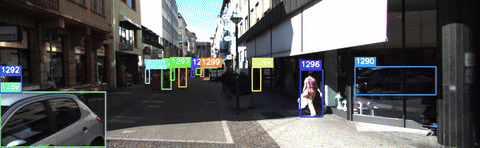
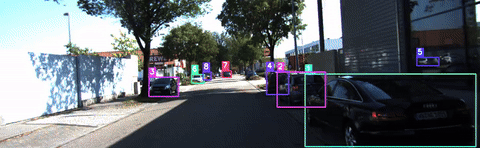

# Multi-Object Tracking on KITTI

A reproducible pipeline:

> YOLOv8 detector → ByteTrack / BoT-SORT → HOTA / MOTA / IDF1 evaluation on KITTI 2D MOT.

[](https://github.com/zarghamsalari/kitti-tracking/actions/workflows/ci.yml)
[](https://kitti-mot-demo.onrender.com)
[](https://www.python.org/)
[](LICENSE)

## Live demo

**[kitti-mot-demo.onrender.com](https://kitti-mot-demo.onrender.com)** — interactive 4-cell ablation viewer. Pick a detector condition (zero-shot vs fine-tuned YOLOv8m), a tracker (ByteTrack vs BoT-SORT), and a sequence to see annotated tracking output with metrics.

## Demo

Pre-rendered tracking output from the zero-shot YOLOv8m + ByteTrack pipeline.
Full 4-cell ablation interactive at the [live demo](https://kitti-mot-demo.onrender.com).

**Pedestrian tracking** (zero-shot + ByteTrack, sequence 0019):


**Car tracking** (zero-shot + ByteTrack, sequence 0001):


## Headline finding

Fine-tuning the detector on KITTI lifts MOTA dramatically (5x on ByteTrack, 2x on BoT-SORT) by removing false positives — the fine-tuned model emits roughly half the detections of the zero-shot baseline. But HOTA is flat across all four cells (0.41-0.47) because the gained DetA is offset by lost AssA.

This is the precision-recall tradeoff that HOTA's decomposition exists to expose. Fewer detections means higher precision (DetA up) but lower recall on hard cases — especially Pedestrians, where fine-tuned recall is only 0.488. The tracker cannot associate what the detector doesn't see, so AssA falls. HOTA = sqrt(DetA x AssA) stays flat because one factor rises while the other drops.

The decomposition identifies the next experiment: retrain at imgsz=1280 to recover Pedestrian recall, which would raise both DetA and AssA simultaneously. Full analysis in [`docs/results.md`](docs/results.md).

## 4-cell ablation

Macro-averaged across Car + Pedestrian on 5 val sequences (0001, 0006, 0013, 0017, 0019):

| Detector | Tracker | HOTA | MOTA | IDF1 | AssA | DetA | IDSw |
|----------|---------|------|------|------|------|------|------|
| Zero-shot YOLOv8m  | ByteTrack | 0.41 | 0.07 | 0.54 | 0.48 | 0.36 | 152 |
| Zero-shot YOLOv8m  | BoT-SORT  | 0.47 | 0.24 | 0.61 | 0.53 | 0.42 | 88  |
| Fine-tuned YOLOv8m | ByteTrack | 0.41 | **0.36** | 0.55 | 0.44 | 0.40 | 159 |
| Fine-tuned YOLOv8m | BoT-SORT  | 0.45 | **0.41** | 0.59 | 0.49 | 0.41 | 86  |

Detection inputs are shared across trackers within each detector condition (verified via `run_meta.json` hash). Tracker differences within a detector pair are not confounded by detection variance.

## Quick start

```bash
git clone https://github.com/zarghamsalari/kitti-tracking.git
cd kitti-tracking
make install
make download          # ~15 GB
make eval              # runs detect → track → metrics
make render-demo       # pre-render 20 demo videos
make demo              # streamlit on http://localhost:8501
```

## Method

1. **Detection.** YOLOv8m (Ultralytics), evaluated zero-shot (COCO-pretrained, COCO car→Car / person→Pedestrian) and fine-tuned (KITTI 5-class: Car, Van, Truck, Pedestrian, Cyclist; trained on 16 sequences at imgsz=640, AdamW, early stopping with patience=20, best at epoch 27). Per-frame inference at `dump_conf=0.1` to MOT16 format; same detection files feed both trackers within each detector condition.
2. **Tracking.** ByteTrack (Kalman + IoU two-stage matching) and BoT-SORT (adds camera motion compensation via sparse optical flow). Both run with `per_class=True` and `frame_rate=10` to match KITTI's capture rate.
3. **Evaluation.** TrackEval (official MOT evaluation suite). HOTA is the primary metric; MOTA and IDF1 reported alongside. All headline numbers are macro-averaged across Car and Pedestrian with equal class weights.

## Reproducibility

Seed=42 across all runs. Sequence-level train/val split (16 train / 5 val) with set-intersection audit (overlap = 0 verified programmatically). Each run dumps `run_meta.json` with git SHA, config hash, weights checksum, and library versions. Tracker hyperparameter search capped at 5 trials on val. `make eval` reproduces the headline numbers from a clean clone within ±0.5 HOTA.

## Repository layout

```
src/tracking/          pipeline modules
  data/                KITTI loader, YOLO format converter
  detection/           YOLOv8 inference + MOT16 dump
  trackers/            ByteTrack, BoT-SORT wrappers
  eval/                TrackEval integration
  viz/                 bbox overlay + video rendering
configs/               YAML configs per detector / tracker
streamlit_app/         interactive 4-cell demo + pre-rendered videos
docs/                  results tables, analysis, demo GIFs
tests/                 unit + integration tests (pytest)
scripts/               training, download, video rendering
```

## License

MIT. KITTI dataset is subject to its own [non-commercial license](https://www.cvlibs.net/datasets/kitti/eval_tracking.php).
